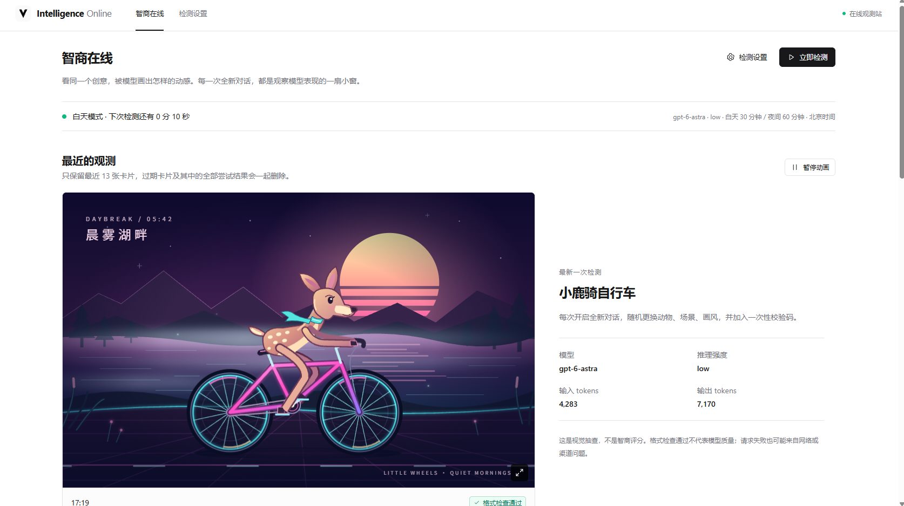
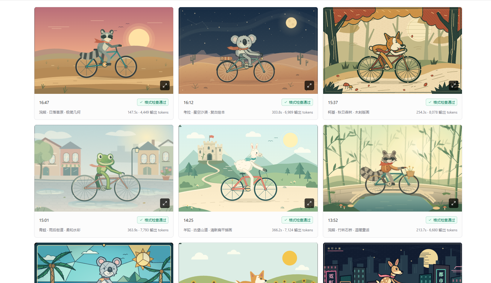

# 智商在线 · Intelligence Online

参考 Yoshub `/intelligence` 页面交互与布局，自行实现的独立版本。包含模型生成 SVG 动画、格式检查、可选 AI 源码复核、自动重试、定时检测与最近 13 次历史记录。无需 Yoshub 管理接口。



## 启动

需要 Node.js 22 或更高版本。在本目录运行：

```sh
npm install
npm start
```

打开 <http://127.0.0.1:4317/intelligence>。点击「检测设置」，填写 Base URL、API Key 和真实模型 ID，保存后点击「立即检测」。密钥留空保存时保持旧值；要移除密钥，点击「清除已保存密钥」后保存。

也可复制 `.env.example` 为 `.env`，填写 `API_BASE_URL`、`API_KEY`、`API_MODEL`。这些环境变量会在每次启动时覆盖保存的对应配置。`PORT` 默认 4317。

## 接口兼容

- 支持 OpenAI 兼容的 Chat Completions 和 Responses，使用 SSE 流式接收避免长时间生成触发网关空闲超时。完整 SVG 接收完毕后再显示，不展示半成品。也兼容提供商直接返回 JSON 的情况。
- Base URL 为 `https://example.com` 时补 `/v1`；已有路径时保留，例如 `https://example.com/openai/v1`。
- 模型列表使用 `GET /models`（相对 Base URL）。部分提供商不支持列表接口，直接手动填写模型 ID 即可。
- 不支持推理参数的模型，请将推理强度设为「不发送（兼容模式）」。
- Chat Completions 的输出上限参数可选择 `max_tokens` 或 `max_completion_tokens`。
- 如提示输出被截断，提高最大输出 Token；默认 12000，包含提供商报告的推理消耗。
- 不会自动切换协议或隐藏失败。API 错误、超时、截断、格式问题都会保留在检测详情中。

## 运行机制

每次尝试从 20 种动物、16 个场景、12 种画风中独立随机选择，共 3,840 种主题组合，并附加一次性 SVG 校验码。随机抽取可能重复。输出必须是可解析的 SVG，并含有 SMIL/CSS 动画声明。静态格式检查不证明视觉正确，也不能证明模型身份或智力水平。

可选 AI 源码检查会额外发起一次模型请求，检查动物、自行车、运动、场景和画风。当前版本检查源码，不截图，不宣称已验证实际渲染画面。复核模型通过相同 Base URL 和 Key 调用，可填写不同模型 ID。默认关闭 AI 复核和自动检测。

单次检测最多自动重试 2 次，每次使用新对话与新挑战。历史卡片显示该轮最后一次尝试，详情可切换全部尝试。失败或有疑问的动画可用于排查，并带有对应状态，不冒充通过结果。

最近 13 次检测保存在 `.data/observations.json`，过期检测及其尝试一并清理。配置和密钥保存在 `.data/config.json`。这两个文件和 `.env` 均不经 HTTP 提供，并已被 `.gitignore` 排除；不要公开分享整个 `.data` 目录。密钥是本机文件存储，不是加密保险箱。

服务启动时恢复记录；未完成任务标记为中断。开启自动检测时，重启后从新的间隔开始计时。关闭服务后不会继续调用 API。自动检测和重试可能产生 API 费用。

## 页面操作

- 最新结果：大幅 SVG 预览、模型、推理强度、Token 消耗。
- 历史卡片：最多 12 张，悬停或键盘聚焦时播放动画。
- 详情弹窗：每次尝试、生成耗时、原始提示词、输出、SHA-256、复核证据、SVG 下载。
- 全局动画开关、浅色/深色主题、移动端布局。
- 模型结果默认禁用脚本、外链和 HTML，通过独立 iframe 沙箱显示。



## 安全与部署

本地默认监听 `127.0.0.1`。公网版本配置 `PUBLIC_ORIGIN=https://example.com`、`BASE_PATH=/intelligence` 和 `ADMIN_PASSWORD_HASH`，通过 Nginx、Caddy 等 HTTPS 反向代理发布到 `/intelligence/`。密码使用随机盐和 scrypt 哈希；服务器只保存哈希，不保存管理密码原文。

观测页公开可看；检测设置、保存配置、读取模型列表、立即检测和停止检测由服务端强制校验管理会话。正确密码解锁 1 小时，可在设置中「退出管理」；会话 Cookie 使用 HttpOnly、SameSite=Strict，HTTPS 部署增加 Secure。连续 5 次错误会暂时锁定该来源 15 分钟，重启服务会清除会话。匿名接口不返回 API 地址、提示词模板、原始模型输出和上游错误详情。

### Docker 部署

支持 Sub2API 同域菜单嵌入。读取菜单传入的 `theme=light|dark`；Sub2API 切换主题更新 iframe 地址后自动跟随。`ui_mode=embedded` 且有有效主题时隐藏独立主题按钮。直接访问可自行切换，偏好使用独立的 `intelligence-observatory.theme` 存储键，不修改 Sub2API 的主题设置。

自动检测以北京时间（UTC+8）调度：08:00（含）至 23:00（不含）使用设置中的基础间隔，23:00 至次日 08:00 使用两倍间隔。跨越 08:00 或 23:00 后，服务会按新时段重新计算下一次检测；正在运行的检测不中断。

Docker Compose 使用 `restart: unless-stopped`，端口只绑定服务器 `127.0.0.1:4317`。反向代理应将配置的子路径转发到该端口，并移除子路径前缀。`.env` 保存部署参数和管理密码哈希，`.data` 挂载持久化配置与历史记录。不要提交这两个文件或目录。

```sh
cp .env.example .env
# 编辑 .env，填写域名、子路径和管理密码哈希
docker compose up -d --build
docker compose logs --tail 100
docker compose stop
```

## 不降智中转站推荐

[K-API](https://kvkks.top/) 是高效稳定的 AI 模型 API 中转平台。1元等于10刀，最新上线 GPT 不降智分组，全天稳定，一个 API Key 即可访问 OpenAI、Claude、Gemini、DeepSeek、Grok 等 150+ 主流模型，价格低至 1 折，服务稳定，可以无缝兼容 Claude Code、OpenClaw 等工具。同时支持网页在线生图，价格低至 3 分钱一张。

```
https://kvkks.top
```

## 验证

```sh
npm test
```

测试使用本地模拟 API，不使用真实密钥、不产生模型费用。覆盖 SVG 清理、接口路径、两种协议、重试、AI 复核成功/失败、Token 累计、记录持久化、13 次保留上限、密钥不回显、敏感文件不可访问、跨站请求拦截。

## License

[MIT](LICENSE)
